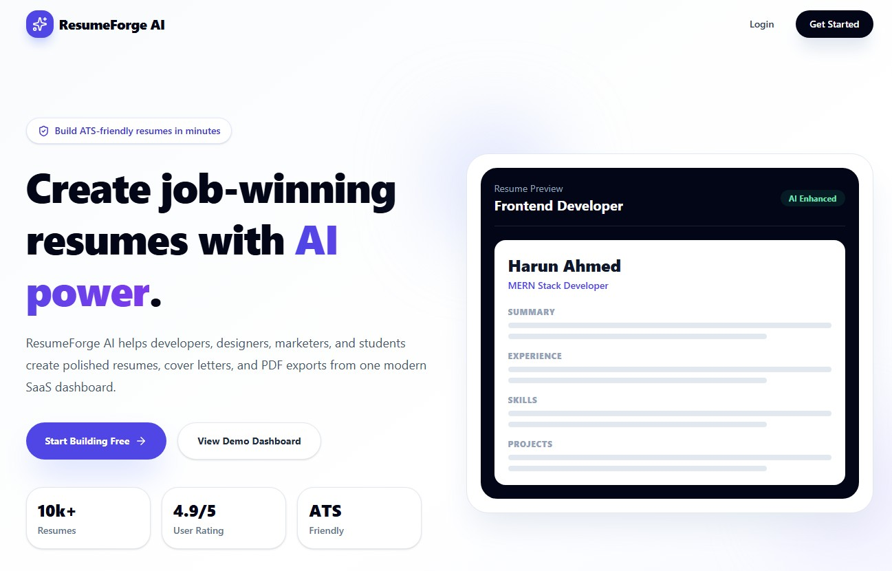
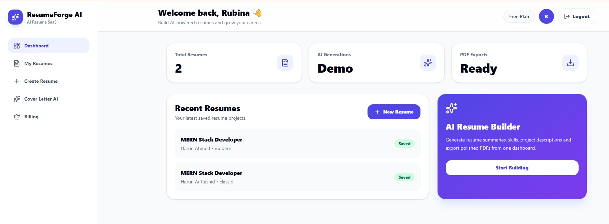
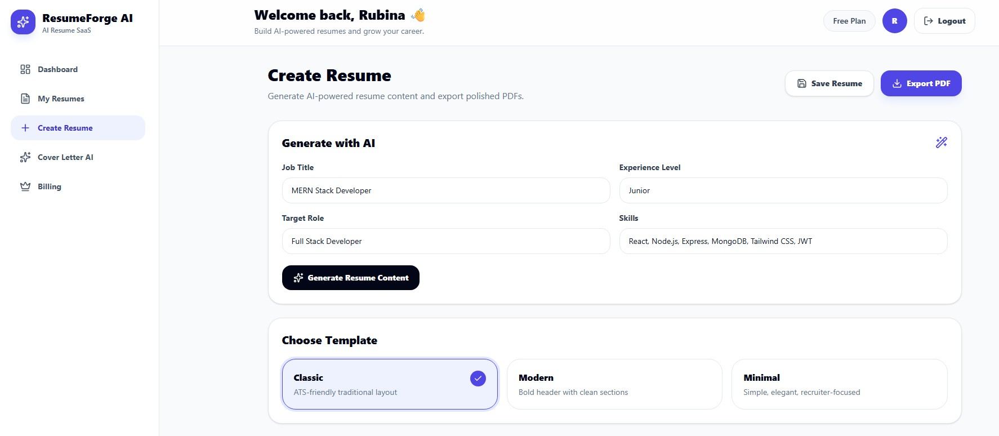
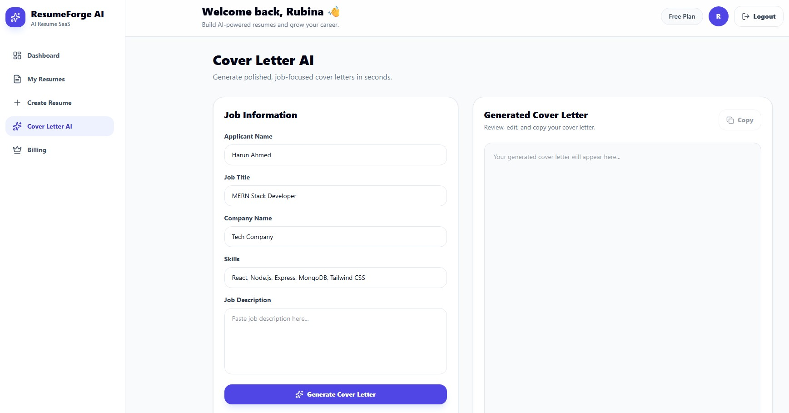
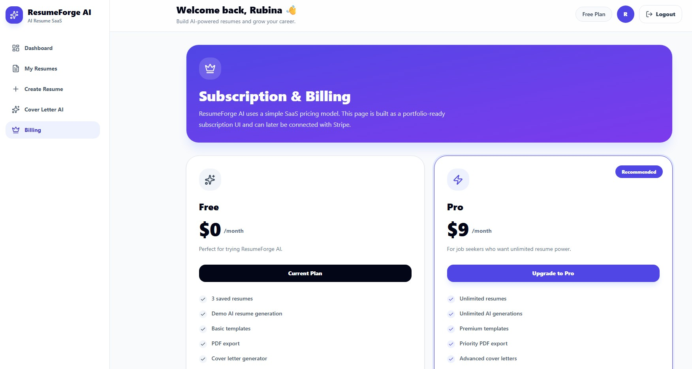
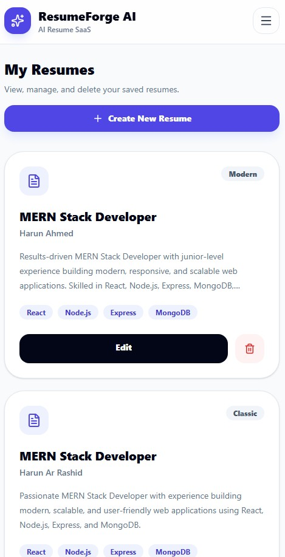

# ResumeForge AI 🚀

ResumeForge AI is a modern MERN Stack AI Resume Builder SaaS application designed to help users generate professional resumes, create cover letters, export ATS-friendly PDFs, and manage resumes from a polished responsive dashboard.

This project was built as a full-stack portfolio-grade SaaS application using React, Node.js, Express, MongoDB Atlas, JWT Authentication, and AI-powered resume generation architecture.

---

# ✨ Features

## Authentication System

* JWT Authentication
* Register/Login system
* Protected dashboard routes
* Persistent login state
* Logout functionality

---

## AI Resume Builder

* AI Resume Summary Generator
* AI Experience Description Generator
* AI Project Description Generator
* Mock AI fallback system
* ATS-friendly resume generation

---

## Resume Builder Features

* Live resume preview
* Professional resume templates
* Classic Template
* Modern Template
* Minimal Template
* Real-time editing
* Mobile responsive layout

---

## Resume Management

* Save resumes to MongoDB Atlas
* View all saved resumes
* Edit existing resumes
* Delete resumes
* Dashboard statistics

---

## PDF Export

* Professional PDF export
* ATS-friendly formatting
* Clean typography
* Recruiter-ready layout

---

## Cover Letter Generator

* AI-style cover letter generation
* Job-focused content
* Copy-to-clipboard functionality
* Editable generated output

---

## SaaS UI Features

* Modern landing page
* Responsive dashboard
* Billing & subscription UI
* Stripe-ready pricing structure
* Mobile-first responsive design
* Professional empty states
* Smooth UI interactions

---

# 🛠 Tech Stack

# Frontend

* React
* Vite
* Tailwind CSS
* React Router DOM
* Axios
* React Hot Toast
* Lucide React
* html2pdf.js

---

# Backend

* Node.js
* Express.js
* MongoDB Atlas
* Mongoose
* JWT Authentication
* bcryptjs
* OpenAI API
* CORS
* dotenv

---

# 📁 Project Structure

```bash
ResumeForge-AI/
│
├── resumeforge-ai-client/
│   │
│   ├── public/
│   │
│   ├── src/
│   │   ├── api/
│   │   ├── assets/
│   │   ├── components/
│   │   │   ├── dashboard/
│   │   │   └── ProtectedRoute.jsx
│   │   │
│   │   ├── hooks/
│   │   │   └── useAuth.js
│   │   │
│   │   ├── pages/
│   │   │   ├── dashboard/
│   │   │   ├── Home.jsx
│   │   │   ├── Login.jsx
│   │   │   └── Register.jsx
│   │   │
│   │   ├── App.jsx
│   │   ├── main.jsx
│   │   └── index.css
│   │
│   ├── .env
│   ├── package.json
│   └── vite.config.js
│
├── resumeforge-ai-server/
│   │
│   ├── src/
│   │   ├── config/
│   │   │   └── db.js
│   │   │
│   │   ├── controllers/
│   │   │   ├── ai.controller.js
│   │   │   ├── auth.controller.js
│   │   │   └── resume.controller.js
│   │   │
│   │   ├── middleware/
│   │   │   └── auth.middleware.js
│   │   │
│   │   ├── models/
│   │   │   ├── Resume.js
│   │   │   └── User.js
│   │   │
│   │   ├── routes/
│   │   │   ├── ai.routes.js
│   │   │   ├── auth.routes.js
│   │   │   └── resume.routes.js
│   │   │
│   │   └── server.js
│   │
│   ├── .env
│   ├── package.json
│   └── nodemon.json
│
└── README.md
```

---

# 🔐 Environment Variables

# Frontend `.env`

```env
VITE_API_URL=http://localhost:5000/api
```

---

# Backend `.env`

```env
PORT=5000
MONGO_URI=your_mongodb_atlas_connection_string
JWT_SECRET=your_jwt_secret
CLIENT_URL=http://localhost:5173
OPENAI_API_KEY=your_openai_api_key
```

> The application includes a mock AI fallback system so the AI demo works even when OpenAI quota is unavailable.

---

# ⚙️ Installation & Setup

# 1. Clone Repository

```bash
git clone https://github.com/your-username/resumeforge-ai-client.git
git clone https://github.com/your-username/resumeforge-ai-server.git
```

---

# 2. Setup Backend

```bash
cd resumeforge-ai-server
npm install
npm run dev
```

Backend runs on:

```bash
http://localhost:5000
```

---

# 3. Setup Frontend

```bash
cd resumeforge-ai-client
npm install
npm run dev
```

Frontend runs on:

```bash
http://localhost:5173
```

---

# 🔌 API Endpoints

# Auth Routes

```bash
POST /api/auth/register
POST /api/auth/login
GET  /api/auth/me
```

---

# Resume Routes

```bash
GET    /api/resumes
POST   /api/resumes
GET    /api/resumes/:id
PUT    /api/resumes/:id
DELETE /api/resumes/:id
```

---

# AI Routes

```bash
POST /api/ai/generate-resume
POST /api/ai/generate-cover-letter
```

---

# 📄 Core Pages

```bash
/
 /login
 /register
 /dashboard
 /dashboard/resumes
 /dashboard/create-resume
 /dashboard/cover-letter
 /dashboard/billing
```

---

# 📸 Screenshots


 
 
 
 
 



---

# 🚀 Deployment

# Frontend Deployment

Recommended:

* Vercel
* Netlify

---

# Backend Deployment

Recommended:

* Render
* Railway
* Cyclic

---

# 💡 Future Improvements

* Stripe Payment Integration
* Real OpenAI Subscription System
* Resume Analytics
* AI Job Description Optimizer
* AI LinkedIn Generator
* Dark Mode
* Resume Sharing System
* Admin Dashboard
* Multi-language Resume Support

---

# 👨‍💻 Author

# Harun Ahmed

MERN Stack Developer

## Portfolio Projects

* ShebaSathi
* ShopVerse
* FlowPilot CRM
* ResumeForge AI

---

# 🌐 Connect With Me

GitHub:
https://github.com/Tsharun25


---

# 📜 License

This project is licensed under the MIT License.

---

# ⭐ Support

If you like this project, give it a star on GitHub ⭐
